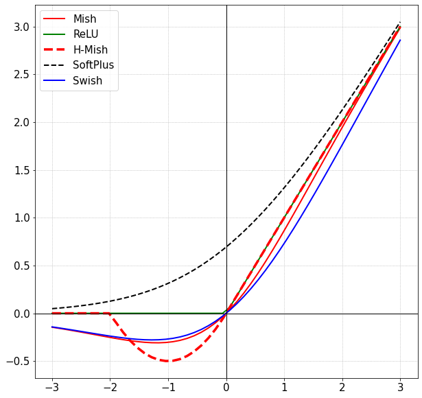

# H-Mish

My hard_mish approximation times as fast as ReLU for all values, and is closer to original Mish than the approximation (continuous second derivative, including at -1.0; or -4.0 for hard_mish2), I fork from.

```julia
julia> function hard_mish(x) # x(x+1)^2 "between" ReLU
         l = x + one(x)
         if x >= zero(x)
           return x
         elseif x <= -one(x)
           return zero(x)
         else
           return l^2*x
         end
       end

julia> function hard_mish2(x)  # x(0.25*x+1)^2 "between" ReLU
         l = convert(typeof(x), 0.25)*x + one(x)
         if x >= zero(x)
           return x
         elseif x <= convert(typeof(x), -4)
           return zero(x)
         else
           return l^2*x
         end
       end

julia> hard_mish2(x::Float16) = convert(Float16, Float32(x)) # converting to Float64 is as fast but thinking of GPUs, and do not fully trust timing as a bit more instructions with Float32

julia> @btime hard_mish2(-1.2)  # near minimum, and similar to for original Mish, unlike for forked hard-mish
  0.024 ns (0 allocations: 0 bytes)
-0.5879999999999999

julia> @btime hard_mish2(Float16(-1.2))  # still performance bug, while it's only slower for the curve-part
  25.317 ns (0 allocations: 0 bytes)
-0.5880136613850482

julia> @btime hard_mish(Float16(-0.2))  # near minimum, but minumum much higher than for orignal Mish
  0.024 ns (0 allocations: 0 bytes)
Float16(-0.1279)

julia> @btime hard_mish(-0.5)
  0.024 ns (0 allocations: 0 bytes)
-0.125

julia> @code_native hard_mish(10.0)
	.text
; ┌ @ REPL[78]:1 within `hard_mish'
	vxorps	%xmm1, %xmm1, %xmm1
; │ @ REPL[78]:3 within `hard_mish'
; │┌ @ operators.jl:350 within `>='
; ││┌ @ float.jl:460 within `<='
	vucomisd	%xmm1, %xmm0
; │└└
	jae	L53
	movabsq	$139696212938512, %rax  # imm = 0x7F0D8F260F10
	vmovsd	(%rax), %xmm2           # xmm2 = mem[0],zero
; │ @ REPL[78]:5 within `hard_mish'
; │┌ @ float.jl:460 within `<='
	vucomisd	%xmm0, %xmm2
; │└
	jae	L57
	movabsq	$.rodata.cst8, %rax
	vaddsd	(%rax), %xmm0, %xmm1
; │ @ REPL[78]:8 within `hard_mish'
; │┌ @ intfuncs.jl:296 within `literal_pow'
; ││┌ @ float.jl:405 within `*'
	vmulsd	%xmm1, %xmm1, %xmm1
; │└└
; │┌ @ float.jl:405 within `*'
	vmulsd	%xmm0, %xmm1, %xmm0
; │└
	retq
L53:
	vmovaps	%xmm0, %xmm1
; │ @ REPL[78]:4 within `hard_mish'
L57:
	vmovaps	%xmm1, %xmm0
	retq
	nop
; └
```

See plots here (substitute extreme values with ReLU, i.e. under -1 or -4, and above 0.0):

http://fooplot.com/#W3sidHlwZSI6MCwiZXEiOiIoMC4yNSp4KzEpXjIqeCIsImNvbG9yIjoiIzAwMDAwMCJ9LHsidHlwZSI6MCwiZXEiOiJ4Kih4KzEpXjIiLCJjb2xvciI6IiMwMDAwMDAifSx7InR5cGUiOjEwMDB9XQ--

[EDIT: workling on this (was wrong): My hard_mish is also as fast for Float16, and hard_mish2 is now too (was orders of magnitute slower for that type with out special casing, while was/is as fast for machine floats).]

I find mine likely to be better with the third-order polynominal (at least not slower), than second-order, the parabola in the original:

Formula - *(x/2).min(2, max(0, x+2))*

<div style="text-align:center"></div>
<p>
    <em>Figure 1. Hard Mish Activation Function</em>
</p>

### CIFAR-10: 

|Architecture|Swish|H-Mish|Mish|ReLU|
|:---:|:---:|:---:|:---:|:---:|
|ResNet-20|90.42%|92.57%|**92.68%**|91.8%|
